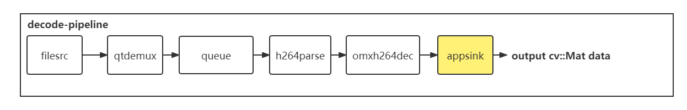
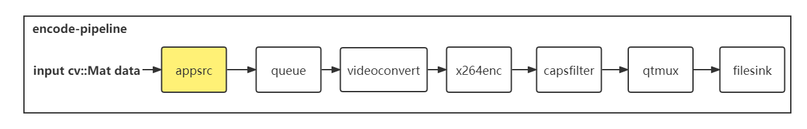

## 介绍
* `gstreamer` `opencv` DEMO
* 读相机：使用 `cv::VideoCapture` 读取uvc相机`cv::Mat`
* 读视频文件：使用了`appsink`从管道中取出数据传到管道外的`cv::Mat`

* 写视频文件：使用了appsrc将数据输入管道，并且使用filesink接受数据


## 运行
* 需要在linux-ubuntu下运行，安装gstreamer可参考[gstreamer docs](https://gstreamer.freedesktop.org/documentation/installing/on-linux.html?gi-language=c)
```
apt-get install libgstreamer1.0-dev libgstreamer-plugins-base1.0-dev libgstreamer-plugins-bad1.0-dev gstreamer1.0-plugins-base gstreamer1.0-plugins-good gstreamer1.0-plugins-bad gstreamer1.0-plugins-ugly gstreamer1.0-libav gstreamer1.0-doc gstreamer1.0-tools gstreamer1.0-x gstreamer1.0-alsa gstreamer1.0-gl gstreamer1.0-gtk3 gstreamer1.0-qt5 gstreamer1.0-pulseaudio
```
* 运行该项目可以参考如下命令
```
mkdir build
cd build
cmake ..
make -j4
cd bin
# 你应该将input.mp4拷贝到根目录下的input文件夹中
# DEMO1 : 读取视频文件(mp4文件h264解码)并将每一帧图片(cv::Mat)储存
./VideoReaderDemo ../../input/input.mp4 ../../input
# DEMO2 : 读取视频文件(mp4文件h264解码)并储存在另一个视频文件(mp4文件h264编码)中
./VideoWriterDemo ../../input/input.mp4 ../../input/output.mp4
# DEMO3 : 读取相机(cv::VideoCapture >> cv::Mat)并储存在另一个视频文件(mp4文件h264编码)中
./CameraDemo /dev/video0 ../../input/output1.mp4

# DEMO4 : 读取相机(cv::VideoCapture >> cv::Mat)并通过H264编码RTP打包UDP推流
# @param1 : uvc相机路径
# @param2 : 目标主机的ip地址(可以是本机)
# @param3 : 目标主机的端口
./TransporterDemo /dev/video0 192.168.1.126 5004
# 可以在在目标主机上(安装了gstreamer)通过以下指令预览视频流(注意端口要一样)
gst-launch-1.0 udpsrc port=5004 caps = "application/x-rtp, media=video, clock-rate=90000, encoding-name=H264, payload=96" ! rtph264depay ! avdec_h264 ! decodebin ! xvimagesink

# DEMO5 : 读取UDP视频流并解包解码转换格式储存在cv::Mat中
# @param1 : 目标主机的端口
./ReceiverDemo 5004
```
## 注意
* 检查文件路径和相机名称
* 设置相机帧率和分辨率在可用范围内，如果得到的Mat的格式和设置的不一样会导致输出的视频格式出错(绿屏)，此外建议帧率先固定在30fps，因为mp4的时间辍我是递增0.04s的无法通过调整帧率修改(bug...)
* 在RZ/G2L板卡上部署时可以尝试将编解码器由`x264enc`和`avdec_h264`替换为带硬件加速的`omxh264enc`和`omxh264dec`（参考RZ的仓库）

